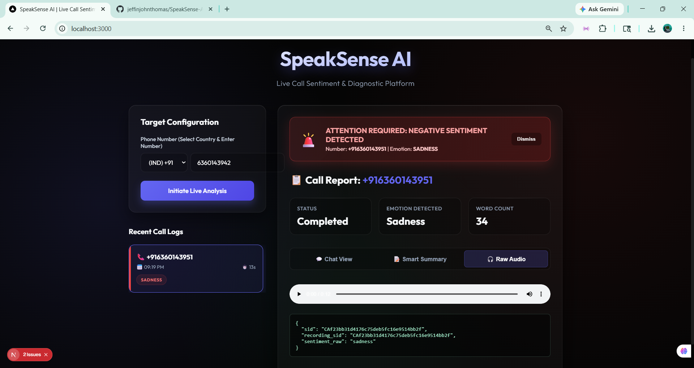
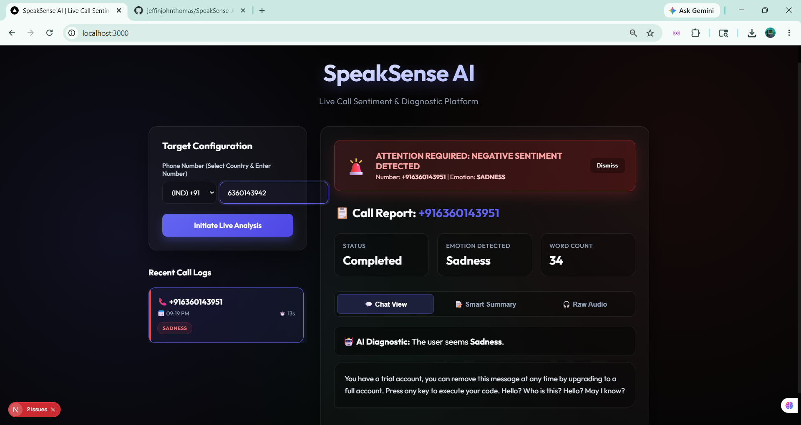
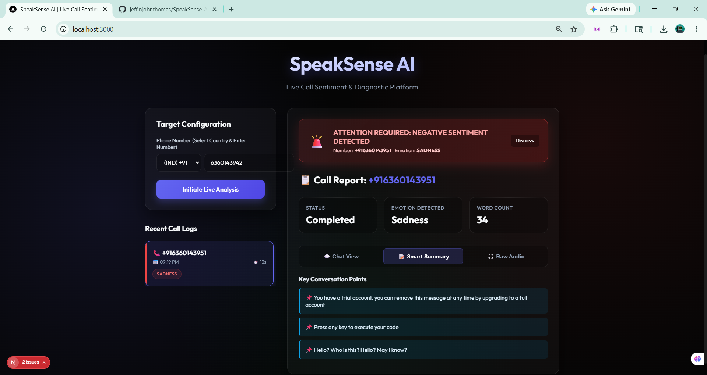

# SpeakSense AI

Live Call Sentiment & Diagnostic Platform. Real-time audio processing, transcription, and emotion detection engine.

## 📸 Screenshots

### Raw Audio Interface


### Chat View


### Call Analysis


---

## 🚀 Getting Started

Follow these step-by-step instructions to run the project locally.

### Prerequisites

Ensure you have the following installed on your system:
- **Node.js** (v18 or higher) for the Next.js frontend
- **Python** (3.8 or higher) for the FastAPI backend
- **Git**

### 1. Clone the repository
```bash
git clone https://github.com/jeffinjohnthomas/SpeakSense-AI.git
cd SpeakSense-AI
```

### 2. Configure Environment Variables
You need to set up your `.env` files for both the frontend and backend.

**Backend (`backend/.env`)**
Create a `.env` file in the `backend/` directory and add your Twilio credentials:
```env
TWILIO_ACCOUNT_SID=your_account_sid
TWILIO_AUTH_TOKEN=your_auth_token
TWILIO_PHONE_NUMBER=your_twilio_number
```
> **Note:** If you are using a Twilio Trial account, ensure you verify any destination phone numbers in your Twilio Console before trying to make calls!

**Frontend (`frontend/.env.local`)**
Create a `.env.local` file in the `frontend/` directory for any frontend-specific environment variables.

### 3. Run the Application (Automatic Method - Windows Only)
You can start both the frontend and backend simultaneously using the provided PowerShell script.

Open PowerShell as an Administrator or bypass the execution policy, and run:
```powershell
powershell -ExecutionPolicy Bypass -File .\start_app.ps1
```
This script will automatically:
1. Install Python backend dependencies (`requirements.txt`)
2. Install Node.js frontend dependencies (`npm install`)
3. Launch the FastAPI backend on Port `8000`
4. Launch the Next.js frontend on Port `3000`

---

### 4. Run the Application (Manual Method)

If the script doesn't work, you can start the services manually in two separate terminal windows.

#### Start the Backend
Open a terminal and run:
```bash
cd backend
pip install -r requirements.txt
python -m uvicorn main:app --reload --host 0.0.0.0 --port 8000
```
> **Backend API Docs:** [http://localhost:8000/docs](http://localhost:8000/docs)

#### Start the Frontend
Open a new terminal and run:
```bash
cd frontend
npm install
npm run dev
```
> **Frontend Interface:** [http://localhost:3000](http://localhost:3000)
